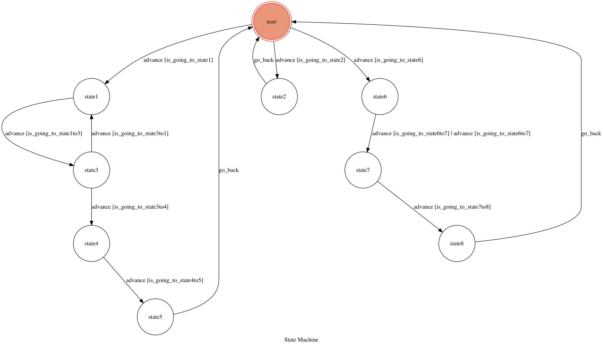

# TOC Project 2017

## Setup

### Prerequisite
* Python 3.6.1

#### Install Dependency
```sh
py -m pip install transitions==0.5.0
py -m pip install Flask==0.12.1
py -m pip install pygraphviz==1.3.1
py -m pip install python-telegram-bot==6.0.0
```


### Secret Data

`API_TOKEN` and `WEBHOOK_URL` in app.py **MUST** be set to proper values.
Otherwise, you might not be able to run your code.

### Run Locally
You can either setup https server or using `ngrok` as a proxy.

**`ngrok` would be used in the following instruction**

```sh
ngrok http 5000
```

After that, `ngrok` would generate a https URL.

You should set `WEBHOOK_URL` (in app.py) to `your-https-URL/hook`.

#### Run the sever

```sh
python3 app.py
```

## Finite State Machine


## Usage
The initial state is set to `user`.

Every time `user` state is triggered to `advance` to another state, it will `go_back` to `user` state after the bot replies corresponding message.

* user
	* Input: "a"
		* Reply: "state1"
	* Input: "g"
		* Reply: "state6"
	* Input: "z"
		* Reply: "state2" and buttons and audio
* state1
    * Input: "c"
		* Reply: "state3" and a telegram photo
* state3
    * Input: "d"
		* Reply: "state1"
    * Input: "e"
        * Reply: "state4"
* state4
    * Input: "f"
		* Reply: "state5"
* state6
    * Input: "h"
        * Reply: "state7"
* state7
    * Input: "i"
        * Reply: "state8"
